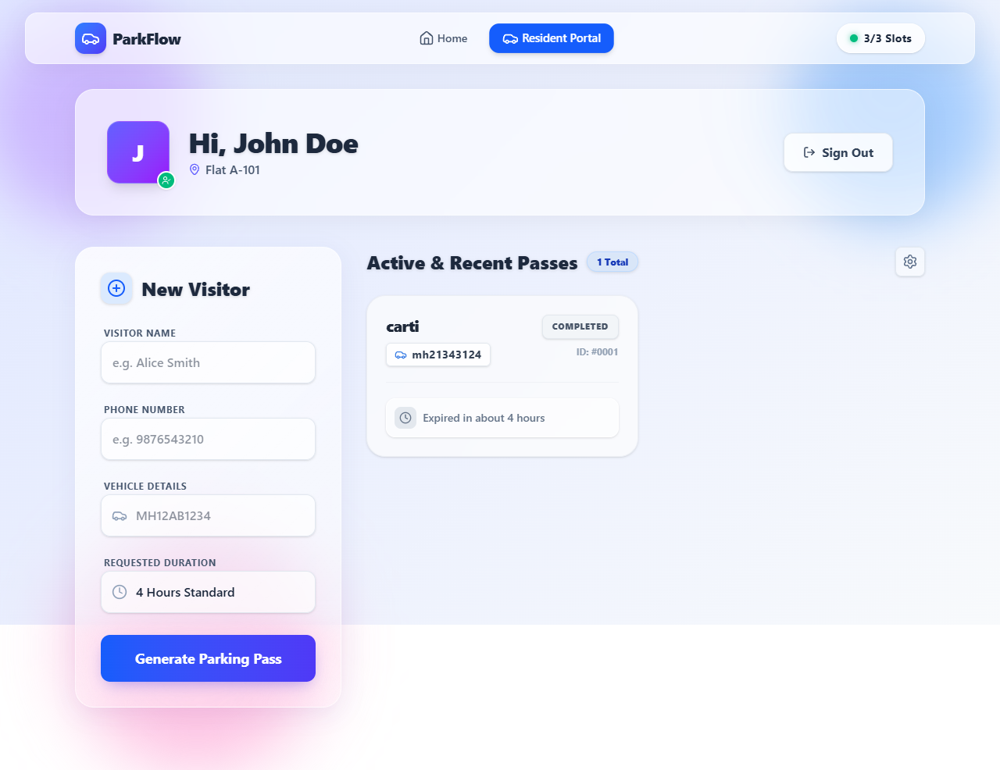
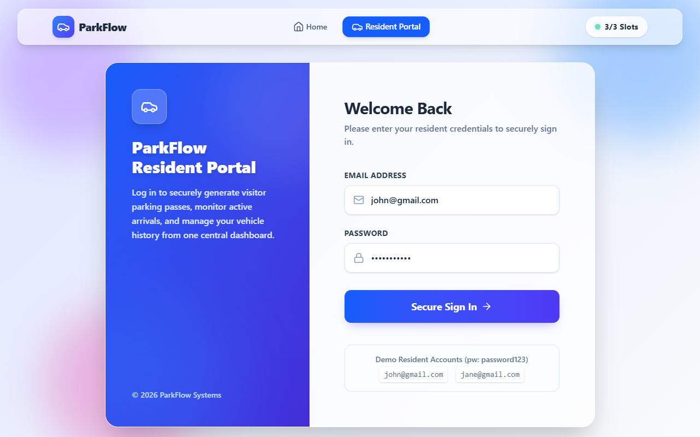
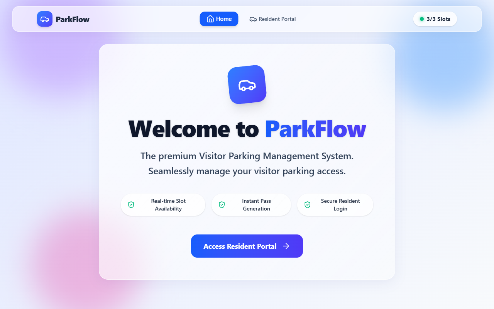

# 🚗 ParkFlow - Premium Visitor Parking Management

[](https://reactjs.org/)
[](https://vitejs.dev/)
[](https://tailwindcss.com/)
[](https://supabase.io/)

**ParkFlow** is a state-of-the-art, unified visitor parking management system designed for modern apartment societies. It seamlessly connects residents and security personnel through a high-performance, serverless architecture powered by Supabase.

---

## ✨ Experience the Interface

| Resident Dashboard | Authentication | Landing Page |
| :---: | :---: | :---: |
|  |  |  |

---

## 🏗 System Architecture

ParkFlow has been refactored for the modern web. We've eliminated legacy local backends in favor of a **Serverless Architecture** using Supabase.

- **Frontend Core**: Two independent React applications built with Vite for lightning-fast HMR and optimized builds.
- **Database & Auth**: Direct integration with **Supabase** for real-time data synchronization, secure authentication, and robust data persistence.
- **Unified Management**: A single root-level orchestrator allows you to boot the entire ecosystem with one command.

---

## 🛠 Features

### 🏠 Resident Portal (`/frontend`)
*For apartment tenants to manage their visitors.*
- **Instant Pass Generation**: Generate 8-digit secure access codes for your visitors.
- **Duration Control**: Request parking for 1h, 2h, 4h, 8h, or overnight stays.
- **Real-time Status**: Track if your visitor has arrived, is currently parked, or has checked out.
- **Pass Management**: Easily cancel pending passes if plans change.
- **Premium UI**: Blurs, gradients, and micro-animations for a high-end feel.

### 🛡 Admin & Security Portal (`/ParkFlow-Admin/frontend`)
*For security guards and society admins to manage property slots.*
- **Live Slot Tracking**: Visual representation of parking occupancy.
- **Digital Validation**: Quickly validate visitor codes and assign them to available slots.
- **Entry/Exit Flow**: One-click entry and exit marking to keep the database accurate.
- **Global History**: Filterable list of all historic and active passes.
- **System Configuration**: Adjust society-wide settings like total parking slots and maximum allowed duration.

---

## 🚀 Getting Started

### Prerequisites
- [Node.js](https://nodejs.org/) (v18 or higher recommended)
- [NPM](https://www.npmjs.com/)

### Installation
1. Clone the repository and navigate to the root folder.
2. Install dependencies for all portals:
   ```bash
   npm run install:all
   ```

### Running the System
You can start both the Resident and Admin portals simultaneously from the root directory:
```bash
npm run dev
```

- **Resident Portal**: [http://localhost:3000](http://localhost:3000)
- **Admin/Security Portal**: [http://localhost:3001](http://localhost:3001)

---

## 🔐 Credentials (Demo)

| Role | Username / Email | Password |
| :--- | :--- | :--- |
| **Admin** | `admin` | `admin123` |
| **Resident** | `arun@parkflow.com` | `password123` |

---

## 📂 Project Structure

```text
ParkFlow/
├── frontend/               # Resident React Portal
├── ParkFlow-Admin/
│   └── frontend/           # Admin/Security React Portal
├── package.json            # Root orchestrator & scripts
└── .gitignore              # Environment & Dependency protection
```

---

*Built with 💙 by the **INNOHACK TEAM***
